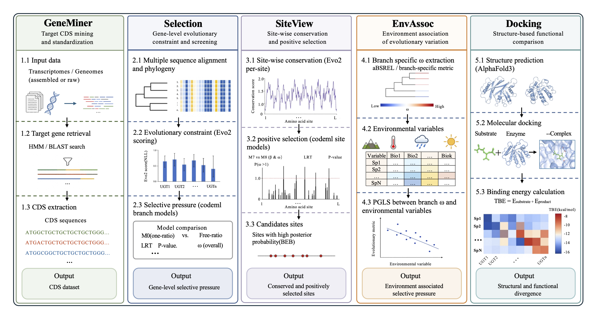

# PhyloSelect

An Integrated Toolkit for Functional Gene Mining, Evolutionary Analysis, and Structural Characterization.

## Introduction

PhyloSelect is a command-line bioinformatics toolkit for functional gene studies in non-model organisms. Its main functionalities include:

- Extracting target CDS sequences from genomic or transcriptomic data.  
- Performing site-level and branch-level evolutionary analyses to detect positive selection and sequence heterogeneity.  
- Conducting selection–environment association analyses.  
- Running molecular docking to evaluate structural-functional effects of sequence variants.  

Users can complete a full workflow from sequence extraction to evolutionary and structural-functional interpretation using PhyloSelect.



For the **complete user manual**, please refer to [user manual](manual.md)

---

## Module Overview

The table below provides a brief overview of the input file types required for each module. For detailed file formats, parameter descriptions, and complete usage instructions, please refer to the [PhyloSelect User Manual](manual.md).

| Module    | Input Type                                   | Description                                  |
| --------- | -------------------------------------------- | -------------------------------------------- |
| GeneMiner | Reads or contigs                             | Raw sequencing data or assembled sequences   |
| SiteView  | Single CDS file, optional phylogenetic tree  | Site-level evolutionary analysis for a gene  |
| Selection | Multiple CDS files, optional tree mapping    | Multi-gene or batch selection analysis       |
| EnvAssoc  | Codon alignment file + environmental data    | Selection–environment association analysis   |
| Docking   | Docking configuration file + phylogenetic tree | Molecular docking analysis                 |

---

## Installation

### System Requirements

- **Supported platforms:** Linux and macOS
- **Python version:** 3.10 or higher
- **Internet access:** Required for modules that use Evo2 sequence features
- **Memory & storage:** Adequate RAM and disk space recommended for large genomic datasets

### Option 1. Conda installation

```bash
conda create -n phyloselect
conda activate phyloselect
conda install -c evanstone -c conda-forge -c bioconda phyloselect
```

### Option 2. Source installation

```bash
git clone https://github.com/evanstone/PhyloSelect.git
cd PhyloSelect
conda env create -f environment.yaml
conda activate phyloselect
pip install .
```

### Verify the installation:

``````bash
# Check program installation
phyloselect --version
# Check dependencies and service availability
phyloselect check
``````

If `phyloselect check` reports that all required dependencies are available, the current environment is ready for analysis. Otherwise, please check whether the Conda environment has been correctly activated, whether all dependencies have been installed, and whether internet access is available for modules that require remote services.

---

## Quick Start

Before running the quickstart examples, please prepare the [example data](quickstart) in your working directory.

If PhyloSelect was installed via Conda, clone the GitHub repository to obtain the `quickstart/` example data:

```
git clone https://github.com/scu-shiyi/PhyloSelect.git
cd PhyloSelect
```

If you have installed PhyloSelect from source:

```
cd PhyloSelect
```

### Example 1: SiteView analysis

**Example Data:**

- CDS sequence of a single gene: `quickstart/sequences/gene1.fasta`

- Corresponding phylogenetic tree file: `quickstart/trees/test1.nwk`

**Run Command:**

```text
cd phyloselect
phyloselect siteview \
-s quickstart/sequences/gene1.fasta \
-t quickstart/trees/test1.nwk \
-o outputdir 
```

**Main Outputs:**

- `gene2EvolutionarySites.png` : Provides a quick overview of the gene’s evolutionary pattern across species, including phylogenetic relationships, site conservation, and variation trends.
- `SiteTestSummary.csv` : Summarizes analysis results across different site models, useful for identifying potential positively selected sites.

### Example 2: Selection analysis

**Example Data:**

- Directory of CDS sequences for multiple genes : `quickstart/sequences`

> **Note:** We do not provide the phylogenetic trees in this example. If you have your own phylogenetic trees, prepare a configuration file mapping sequences to their corresponding tree files(refer to the [user manual](manual.md)), and specify it using the `--tree-file-map` option.

**Run Command:**

```bash
phyloselect selection -i quickstart/sequences -o outputdir
```

**Main Outputs:**

- `Evo_dNdS.png`：Shows the Evo scores and dN/dS patterns of different genes across the phylogenetic tree.
- Individual folders for each gene containing:
  - `*_omega.csv` – ω (dN/dS) estimates for different branches.
  - `*_omega.csv` :  ω (dN/dS) estimates for different branches.

### Example 3: EnvAssoc analysis

**Example Data:**

- CDS sequence file: `quickstart/sequences/gene3.fasta`
- Environmental trait matrix: `quickstart/config/env_traits.csv`
- Corresponding phylogenetic tree file: `quickstart/trees/test1.nwk`

**Run command:**

```bash
phyloselect envassoc \
-s quickstart/sequences/gene3.fasta \
-e quickstart/config/env_traits.csv \
-t quickstart/trees/test1.nwk \
-o outputdir
```

**Main Outputs:**

- `Table1_aBSREL_significant_branches.csv` : significant branches identified by aBSREL as showing evidence of episodic positive selection.
- `Table2_PGLS_environment_association.csv` : association results between branch-level selection signals and environmental variables based on PGLS analysis.

### Example 4: Docking analysis

**Example Data:**

- Docking configuration file: `quickstart/config/docking_config.csv`
- Phylogenetic tree file for result visualization: `quickstart/trees/test2.nwk`

> **Note:** The docking configuration file should include the target genes, paths to their modeled protein structures, substrates, products, key cofactors, and reference proteins for active-pocket definition. Please refer to the [user manual](manual.md) for the required file format.

**Run command:**

```bash
phyloselect docking \
-c quickstart/config/docking_config.csv \
-t quickstart/trees/test2.nwk \
-o outputdir
```

**Main Outputs：**

- `TotalBindingEnergy.png` : visualization of binding energy patterns across the tested receptors or lineages.
- `DockingResults.csv` : detailed docking results, including receptor–ligand combinations and binding energy values.
- Additional visualization files, such as `SubstrateProductPreference.png` and `CofactorBindingEnergy.png`, are also generated.
---

## Full Demo Data

The `quickstart/` directory is intended for installation testing and small-scale demonstration.Complete demo datasets are provided in the `DEMO/` directory. For detailed instructions on how to run each demo, interpret the outputs, and understand the analysis results, please refer to the [PhyloSelect User Manual](manual.md).

---

## Citation

If you use PhyloSelect in your research, please cite this repository. Citation information will be updated after the related manuscript is published.

## License

PhyloSelect is released under the MIT License. See [LICENSE](LICENSE) for details.
